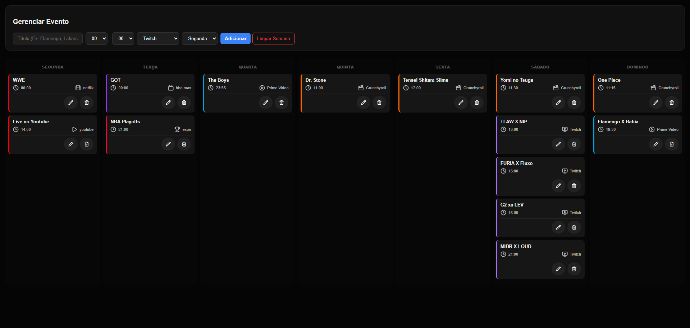

# 📅 EventFlow

Um organizador semanal dinâmico e visual para acompanhar lançamentos de episódios (animes/séries) e horários de partidas esportivas (futebol, basquete e eSports).

## Sobre o Projeto

Este projeto nasceu da necessidade de centralizar os horários de diferentes tipos de entretenimento em um só lugar. Ele permite gerenciar uma agenda semanal personalizada de forma simples e intuitiva.

### O que eu acompanho aqui:

- **Animes e Séries:** Lançamentos em plataformas como Crunchyroll, Netflix, Prime Video e HBO Max.
- **Esportes:** Partidas de Futebol e Basquete (NBA).
- **eSports:** Torneios transmitidos via Twitch e Youtube.

## Funcionalidades

- **Organização por Dias:** Colunas separadas de Segunda a Domingo.
- **Identificação Visual:** Cards com cores e ícones automáticos baseados na plataforma escolhida.
- **Persistência de Dados:** Os eventos ficam salvos no seu navegador (LocalStorage), então você não perde nada ao fechar a aba.
- **Gerenciamento Completo:** Adicione, edite horários/títulos ou exclua eventos que já passaram.
- **Interface Responsiva:** Funciona bem em computadores e dispositivos móveis.

## Tecnologias Utilizadas

- **HTML5** (Estrutura)
- **CSS3** (Estilização com variáveis, Grid, Flexbox e animações de escala)
- **JavaScript Moderno** (Manipulação de DOM e LocalStorage)
- **Lucide Icons** (Biblioteca de ícones leves e elegantes)

## Como usar

1. **Adicionar:** Preencha o título, selecione o horário, a plataforma e o dia da semana. Clique em "Adicionar".
2. **Editar:** Clique no ícone de lápis em qualquer card para carregar os dados de volta ao formulário.
3. **Excluir:** Clique na lixeira para remover um evento específico.
4. **Limpar Tudo:** Use o botão "Limpar Semana" para resetar todo o seu cronograma.

---

Desenvolvido por Ryan Urtiga
